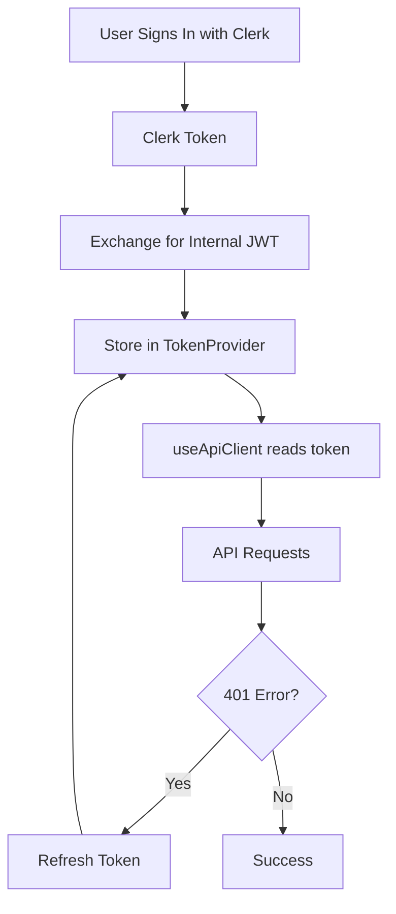

# API Client Architecture

This directory contains the unified API client implementation for the application.

## Overview

The API client architecture provides a simple, unified interface for accessing the backend API from both client and server contexts. It handles authentication, token management, and provides type-safe API calls through OpenAPI-generated types.

## Quick Start

### Client Components (React)

```tsx
import { useApiClient } from "@/lib/api";

function MyComponent() {
  const api = useApiClient();

  // Using React Query hooks
  const { data, isLoading } = api.useQuery("get", "/farms");

  // Using mutations
  const mutation = api.useMutation("post", "/farms");

  return <div>{/* your component */}</div>;
}
```

### Server Components / Route Handlers

```tsx
import { getServerApiClient } from "@/lib/api/server";

// In a Server Component
export default async function FarmPage() {
  const api = await getServerApiClient();
  const { data } = await api.client.GET("/farms");
  return <div>{/* render farms */}</div>;
}

// In a Route Handler
export async function GET() {
  const api = await getServerApiClient();
  const { data } = await api.client.GET("/farms");
  return Response.json(data);
}
```

## API Reference

### Client-Side

#### `useApiClient()`

React hook that returns an authenticated API client for use in Client Components.

**Features:**

- Automatically includes authentication headers from TokenProvider
- Handles token refresh via interceptors
- Returns memoized client instance
- Integrates with React Query for caching

**Example:**

```tsx
function Dashboard() {
  const api = useApiClient();

  // React Query integration
  const { data: farms } = api.useQuery("get", "/farms");

  // Direct client usage
  const handleClick = async () => {
    const response = await api.client.GET("/farms/{id}", {
      params: { path: { id: "123" } },
    });
  };
}
```

### Server-Side

#### `getServerApiClient()`

Creates an API client for Server Components, Route Handlers, and Server Actions.

**Features:**

- Exchanges Clerk token for internal JWT automatically
- Request-scoped (new instance per request)
- Returns unauthenticated client if user not signed in

**Example:**

```tsx
// Server Component
export default async function ProfilePage() {
  const api = await getServerApiClient();
  const { data, error } = await api.client.GET("/users/profile");

  if (error) {
    return <div>Error loading profile</div>;
  }

  return <ProfileDisplay user={data} />;
}
```

#### `getPublicApiClient()`

Creates an unauthenticated API client for public endpoints.

**Use cases:**

- Health checks
- Public data endpoints
- Authentication endpoints

**Example:**

```tsx
const api = getPublicApiClient();
const { data } = await api.client.GET("/health");
```

#### `createApiClientWithToken(token: string)`

Creates an API client with a specific authentication token.

**Use cases:**

- Initial Clerk token exchange
- User registration with Clerk token
- Any pre-session authenticated requests

**Example:**

```tsx
// In auth.ts - exchanging Clerk token for internal JWT
export async function exchangeClerkToken(clerkToken: string) {
  const api = createApiClientWithToken(clerkToken);
  const { data } = await api.client.POST("/users/login", {
    body: { token: clerkToken },
  });
  return data;
}
```

## Architecture Details

### Token Flow



### File Structure

```
lib/api/
├── index.ts                # Main exports (client-safe only)
├── client.ts              # Client-side React hook
├── client-exports.ts      # Client-side exports wrapper
├── server.ts              # Server-side functions
├── server-exports.ts      # Server-side exports wrapper
├── shared.ts              # Shared utilities (client & server safe)
├── auth.ts                # Clerk token exchange
├── clerk-metadata.ts      # Clerk metadata management
├── user-registration.ts   # User registration logic
├── token-refresh.ts       # Token refresh logic
├── token-revocation.ts    # Logout/revocation logic
├── README.md              # This file
└── MIGRATION_SUMMARY.md   # Migration details
```

**Important Note**: The main `index.ts` file only exports client-safe functions. To use server-side functions like `getServerApiClient`, you must import directly from `@/lib/api/server` to avoid importing server-only dependencies into client components.

### Internal Utilities

These files handle specific authentication flows:

- **auth.ts**: Exchanges Clerk tokens for internal JWTs
- **token-refresh.ts**: Refreshes expired internal JWTs
- **token-revocation.ts**: Revokes tokens during logout
- **user-registration.ts**: Registers new users with the backend

## Error Handling

All API functions use the `ApiError` class for consistent error handling:

```tsx
import { ApiError } from "@/lib/errors";

try {
  const api = await getServerApiClient();
  const { data } = await api.client.GET("/protected-resource");
} catch (error) {
  if (error instanceof ApiError) {
    console.error("API Error:", {
      status: error.status,
      code: error.errorCode,
      message: error.message,
    });
  }
}
```

## Best Practices

### 1. Use the Right Pattern

- **Client Components**: Always use `useApiClient()` from `@/lib/api`
- **Server Components**: Always use `getServerApiClient()` from `@/lib/api/server`
- **Public Endpoints**: Use `getPublicApiClient()` from `@/lib/api`
- **Pre-session Auth**: Use `createApiClientWithToken()` from `@/lib/api`

**Import Path Guidelines:**
- Client components should import from `@/lib/api`
- Server components must import `getServerApiClient` from `@/lib/api/server`
- Never import server-only functions from the main barrel export

### 2. Handle Loading States

```tsx
function MyComponent() {
  const api = useApiClient();
  const { data, isLoading, error } = api.useQuery("get", "/farms");

  if (isLoading) return <LoadingSpinner />;
  if (error) return <ErrorMessage error={error} />;

  return <FarmList farms={data} />;
}
```

### 3. Type Safety

The API client is fully typed via OpenAPI schemas:

```tsx
// TypeScript will enforce correct parameters and return types
const { data } = await api.client.GET("/farms/{id}", {
  params: {
    path: { id: farmId }, // Required path parameter
    query: { include: "crops" }, // Optional query parameter
  },
});
```

### 4. Error Boundaries

Wrap your components with error boundaries for better error handling:

```tsx
<ErrorBoundary fallback={<ErrorFallback />}>
  <MyApiComponent />
</ErrorBoundary>
```

## Security Considerations

1. **Token Storage**: Tokens are stored in memory via React Context, not in localStorage
2. **Automatic Refresh**: Tokens are refreshed 5 minutes before expiration
3. **Secure Logout**: Tokens are revoked on the server during logout
4. **Request Scoping**: Server-side clients are scoped to individual requests

## Troubleshooting

### Common Issues

1. **"No authenticated API client available"**

   - Ensure you're signed in
   - Check that TokenProvider is wrapping your component

2. **401 Unauthorized Errors**

   - Token may be expired - check token refresh is working
   - Ensure Clerk authentication is properly configured

3. **Type Errors**
   - Run `bun run generate:api` to update OpenAPI types
   - Ensure you're using the correct endpoint path

### Debug Mode

Enable debug logging for the API client:

```tsx
// In your component or page
import { logger } from "@/lib/utils/logger";

logger.setLevel("debug"); // See all API requests and responses
```

## Contributing

When adding new API functionality:

1. Add new endpoints to the OpenAPI spec
2. Run `bun run generate:api` to update types
3. Use the appropriate client based on the context
4. Add error handling using `ApiError`
5. Update this README if adding new patterns
